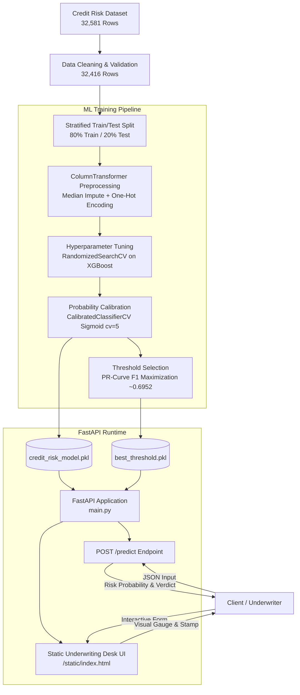

# Credit Risk ML System

**Explainable Credit Risk Prediction with XGBoost, Probability Calibration, SHAP, FastAPI, and Cloud Deployment**

[](https://www.python.org/)
[](https://fastapi.tiangolo.com/)
[](https://scikit-learn.org/)
[](https://xgboost.readthedocs.io/)
[](render.yaml)

An end-to-end, explainable credit risk assessment system that trains a Sigmoid-calibrated XGBoost classifier on 32,000+ loan applications, interprets predictions using SHAP, optimizes decision thresholds for risk classification, and serves inferences via a FastAPI REST API and interactive web underwriting dashboard.

---

## Table of Contents
- [Project Overview](#project-overview)
- [Key Features](#key-features)
- [System Architecture](#system-architecture)
- [Machine Learning Pipeline](#machine-learning-pipeline)
- [Dataset](#dataset)
- [Model & Hyperparameters](#model--hyperparameters)
- [Probability Calibration](#probability-calibration)
- [Classification Threshold](#classification-threshold)
- [SHAP Explainability](#shap-explainability)
- [Model Evaluation](#model-evaluation)
- [Limitations and Risk Notes](#limitations-and-risk-notes)
- [FastAPI REST API](#fastapi-rest-api)
- [API Example](#api-example)
- [Local Setup](#local-setup)
- [Running the API](#running-the-api)
- [Frontend / Underwriting Dashboard](#frontend--underwriting-dashboard)
- [Deployment Configuration](#deployment-configuration)
- [Project Structure](#project-structure)
- [Reproducibility](#reproducibility)
- [Troubleshooting](#troubleshooting)
- [Technology Stack](#technology-stack)
- [Security & Responsible Use](#security--responsible-use)
- [Future Improvements](#future-improvements)
- [Author & Project Information](#author--project-information)

---

## Project Overview

In consumer lending, assessing borrower credit risk is critical to reducing default rates while maintaining fair access to credit. Traditional scoring models often lack non-linear expressiveness, whereas complex black-box machine learning models risk producing uncalibrated probabilities and uninterpretable decisions.

This repository provides a complete credit-risk machine learning pipeline:
1. **Data Cleaning & Preprocessing:** Handles missing values, deduplicates rows, filters unrealistic data points, and scales/encodes features safely via scikit-learn pipelines.
2. **Class Imbalance & Model Training:** Implements an `XGBClassifier` with class weighting (`scale_pos_weight ≈ 3.63`) and optimizes hyperparameters using 5-fold Stratified K-Fold cross-validation.
3. **Probability Calibration:** Applies 5-fold Sigmoid (Platt) calibration (`CalibratedClassifierCV`) to align raw model confidence with actual default rates.
4. **Threshold Optimization:** Derives an optimal classification threshold (`0.6951976431239382`) using Precision-Recall F1 optimization to convert probabilities into binary decisions (`High Risk` vs. `Low Risk`).
5. **Model Interpretability:** Employs SHAP (`TreeExplainer`) for global feature importance and local instance-level predictions.
6. **API & Interface Deployment:** Packages serialized artifacts (`credit_risk_model.pkl` and `best_threshold.pkl`) into a FastAPI application serving both REST API endpoints and a static frontend web underwriting dashboard (`Credit Ledger`).

---

## Key Features

* **Calibrated Credit Risk Scoring:** Computes true probability estimates of borrower default using Sigmoid calibration.
* **Optimized Decision Cutoff:** Uses a custom Precision-Recall optimized threshold (`~0.6952`) stored independently from the calibrated model artifact.
* **SHAP Interpretability:** Evaluates global feature importance and local instance-level waterfall plots via SHAP `TreeExplainer`.
* **Automated Data Pipeline:** Employs `ColumnTransformer` with median imputation for numerical features and constant imputation with One-Hot Encoding for categorical features.
* **Class Imbalance Handling:** Adjusts minority class loss weighting based on training class proportions.
* **FastAPI Backend:** Serves high-performance async inference endpoints with automated input schema validation powered by Pydantic.
* **Interactive Underwriting Dashboard:** Integrates a static frontend (`Credit Ledger`) for real-time risk assessment directly from the web browser.
* **Cloud Infrastructure-as-Code:** Includes Render platform configuration (`render.yaml`) and runtime specifications (`runtime.txt`).

---

## System Architecture



### Component Breakdown
1. **Data Ingestion & Cleaning:** Validates records, removes duplicate entries, filters invalid age/employment values, and partitions data into an 80/20 stratified train/test split.
2. **Preprocessing Pipeline:** Applies numerical median imputation and categorical one-hot encoding seamlessly during cross-validation and inference to eliminate data leakage.
3. **Calibrated Model Training:** Trains a tuned XGBoost ensemble and calibrates predicted probabilities using 5-fold Sigmoid calibration.
4. **Artifact Serialization:** Serializes the trained pipeline and decision threshold using `joblib`.
5. **FastAPI Web Service:** Loads artifacts at application startup (`lifespan`) and exposes prediction endpoints alongside the static web dashboard.

---

## Machine Learning Pipeline

The machine learning pipeline implemented in `Credit_Risk.ipynb` follows these sequential steps:

1. **Data Loading:** Ingests `credit_risk_dataset.csv` (32,581 raw records across 12 features).
2. **Exploratory Analysis & Quality Checks:** Identifies missing values in `person_emp_length` (895) and `loan_int_rate` (3,116), checks target distribution, and inspects numerical feature distributions.
3. **Data Cleaning & Filtering:**
   - Drops duplicate rows (reducing dataset from 32,581 to 32,416 rows).
   - Filters invalid ages (`person_age` between 18 and 100).
   - Filters invalid employment duration (`person_emp_length` <= `person_age` and <= 60).
   - Ensures positive loan amounts (`loan_amnt > 0`).
4. **Stratified Train-Test Split:** Splits data into 80% training set (25,111 samples) and 20% testing set (6,305 samples) stratified by target `loan_status`.
5. **Class Weighting:** Calculates class imbalance ratio (scale_pos_weight = negatives / positives = 3.63) to weight positive default instances during XGBoost training.
6. **Feature Preprocessing Setup:**
   - Numerical (`person_age`, `person_income`, `person_emp_length`, `loan_amnt`, `loan_int_rate`, `loan_percent_income`, `cb_person_cred_hist_length`): Median imputation.
   - Categorical (`person_home_ownership`, `loan_intent`, `loan_grade`, `cb_person_default_on_file`): Constant imputation (`fill_value="Missing"`) + `OneHotEncoder(handle_unknown="ignore")`.
7. **Cross-Validation & Model Selection:** Evaluates baseline Logistic Regression vs. XGBoost using 5-Fold Stratified K-Fold CV.
8. **Hyperparameter Tuning:** Runs `RandomizedSearchCV` (150 iterations, 5-fold CV) optimizing Average Precision (PR-AUC).
9. **Probability Calibration:** Wraps the tuned estimator in `CalibratedClassifierCV(method="sigmoid", cv=5)` to output well-calibrated probabilities.
10. **Threshold Tuning:** Computes Precision-Recall curve metrics on test set probabilities to identify the optimal F1 threshold (`0.6951976431239382`).
11. **SHAP Interpretation:** Computes TreeExplainer SHAP values on transformed test features for global feature ranking and local prediction decomposition.
12. **Model Serialization:** Exports `credit_risk_model.pkl` and `best_threshold.pkl`.

---

## Dataset

The model is trained on the Credit Risk Dataset (`credit_risk_dataset.csv`), containing historical loan application records.

* **Total Raw Samples:** 32,581
* **Cleaned Samples:** 32,416
* **Target Column:** `loan_status` (`0` = Repaid / Non-default, `1` = Default)
* **Target Class Distribution:** 78.18% Non-default (`0`), 21.82% Default (`1`)

### Input Feature Description

| Feature Name | Data Type | Preprocessing | Description |
| :--- | :--- | :--- | :--- |
| `person_age` | Numeric (`int64`) | Median Imputer | Age of the applicant in years |
| `person_income` | Numeric (`int64`) | Median Imputer | Annual income of the applicant |
| `person_home_ownership` | Categorical (`str`) | One-Hot Encoded | Home ownership status (`RENT`, `OWN`, `MORTGAGE`, `OTHER`) |
| `person_emp_length` | Numeric (`float64`) | Median Imputer | Employment length in years (895 missing values in raw data) |
| `loan_intent` | Categorical (`str`) | One-Hot Encoded | Purpose of loan (`PERSONAL`, `EDUCATION`, `MEDICAL`, `VENTURE`, `HOMEIMPROVEMENT`, `DEBTCONSOLIDATION`) |
| `loan_grade` | Categorical (`str`) | One-Hot Encoded | Credit grade of loan (`A`, `B`, `C`, `D`, `E`, `F`, `G`) |
| `loan_amnt` | Numeric (`int64`) | Median Imputer | Requested loan amount |
| `loan_int_rate` | Numeric (`float64`) | Median Imputer | Interest rate of the loan (3,116 missing values in raw data) |
| `loan_percent_income` | Numeric (`float64`) | Median Imputer | Ratio of loan amount to annual income |
| `cb_person_default_on_file` | Categorical (`str`) | One-Hot Encoded | Historical default record on credit bureau file (`Y`, `N`) |
| `cb_person_cred_hist_length` | Numeric (`int64`) | Median Imputer | Credit history duration in years |

---

## Model & Hyperparameters

The core classifier is an **XGBoost Classifier (`XGBClassifier`)** embedded inside a scikit-learn `Pipeline` and calibrated via 5-fold Sigmoid calibration.

### Tuned Hyperparameters

The following optimal hyperparameters were discovered via `RandomizedSearchCV` (150 iterations, 5-fold Stratified K-Fold CV scoring `average_precision`):

```python
{
    "classifier__n_estimators": 366,
    "classifier__max_depth": 5,
    "classifier__learning_rate": 0.1316690691287814,
    "classifier__subsample": 0.845303589935636,
    "classifier__colsample_bytree": 0.9374256499933686,
    "classifier__min_child_weight": 7,
    "classifier__gamma": 2.391359792655321
}
```

* **Loss / Objective:** Binary Logistic (`binary:logistic`)
* **Class Weighting:** `scale_pos_weight ≈ 3.63`
* **Random State:** `42`

---

## Probability Calibration

In credit risk applications, a raw classification confidence score is insufficient; financial decisions require **calibrated probabilities** where a predicted default probability of 30% corresponds to an empirical 30% default rate in practice.

### Calibration Implementation
* **Method:** Sigmoid Calibration (Platt Scaling) via `CalibratedClassifierCV`.
* **Cross-Validation:** 5-fold internal cross-validation (`cv=5`) on training data (`X_train`, `y_train`).
* **Underlying Estimator:** Best estimator pipeline from `RandomizedSearchCV`.

```python
from sklearn.calibration import CalibratedClassifierCV

calibrated_model = CalibratedClassifierCV(
    best_model,
    method="sigmoid",
    cv=5
)
calibrated_model.fit(X_train, y_train)
```

The saved model artifact (`credit_risk_model.pkl`) is the fitted `CalibratedClassifierCV` pipeline.

---

## Classification Threshold

Probability prediction and binary classification are decoupled in this system:
1. The calibrated model predicts continuous probability: P(default = 1 | X).
2. The decision threshold evaluates whether P(default = 1 | X) >= threshold.

### Verified Threshold Value
* **Threshold Value:** `0.6951976431239382`
* **Selection Strategy:** Precision-Recall curve F1-score maximization evaluated on test probabilities in `Credit_Risk.ipynb`.
* **Artifact:** Saved separately as `best_threshold.pkl`.

### Runtime Decision Logic
```python
probability = ml_model["model"].predict_proba(input_df)[:, 1][0]
prediction = int(probability >= ml_model["threshold"])
result = "High Risk" if prediction == 1 else "Low Risk"
```

---

## SHAP Explainability

To provide transparency into model decisions, the notebook uses **SHAP (SHapley Additive exPlanations)** with `TreeExplainer` on the uncalibrated XGBoost classifier.

* **Global Explainability (`shap.summary_plot`):** Ranks features across all test instances. Primary risk drivers identified include:
  - `loan_percent_income` (higher loan-to-income ratio increases default risk)
  - `loan_int_rate` (higher interest rate correlates with default risk)
  - `person_income` (higher income decreases default risk)
  - `loan_grade` (poorer loan grades push prediction toward default)
* **Local Explainability (`shap.plots.waterfall`):** Decomposes individual predictions into specific positive and negative SHAP contributions relative to the baseline expected value.

*Note: SHAP explains feature attributions within the trained model; it does not establish causal mechanisms.*

---

## Model Evaluation

Models were evaluated on a holdout test set of **6,305 samples** (20% stratified split of the cleaned dataset) as well as 5-Fold Stratified Cross-Validation during tuning.

### Performance Summary

| Metric | Baseline Logistic Regression (Test Set) | Tuned XGBoost (Test Set, Threshold 0.5) | Cross-Validation Tuning Score |
| :--- | :---: | :---: | :---: |
| **Data Split / Scope** | Holdout Test (6,305 samples) | Holdout Test (6,305 samples) | 5-Fold Stratified K-Fold CV |
| **Optimization Metric** | Balanced Class Weights | Default 0.5 Cutoff | Average Precision (PR-AUC) |
| **Accuracy** | 0.82 | **0.92** | — |
| **Precision (Class 1)** | 0.56 | **0.81** | — |
| **Recall (Class 1)** | 0.79 | **0.81** | — |
| **F1 Score (Class 1)** | 0.65 | **0.81** | — |
| **PR-AUC / Avg Precision** | — | — | **0.90** |

### Test Set Classification Report (Tuned XGBoost)

```text
              precision    recall  f1-score   support

    Class 0       0.95      0.95      0.95      4943
    Class 1       0.81      0.81      0.81      1362

   accuracy                           0.92      6305
  macro avg       0.88      0.88      0.88      6305
weighted avg       0.92      0.92      0.92      6305
```

---

## Limitations and Risk Notes

* **Dataset Scope:** Derived from a synthetic or public credit dataset (`credit_risk_dataset.csv`) without longitudinal macro-economic factors.
* **Distribution Shift:** Features such as interest rates or income ranges may shift over time, requiring periodic re-calibration and re-training.
* **Threshold Sensitivity:** The decision threshold (`~0.6952`) was optimized on test set Precision-Recall metrics within the notebook. In live production environments, thresholds should be set according to specific institutional risk tolerances and cost matrices.
* **Missing Value Handling:** Missing values are imputed using median values (`person_emp_length`, `loan_int_rate`); abrupt changes in missingness patterns could impact accuracy.
* **Demonstration Notice:** This system is an engineering demonstration and is not certified for real-world automated credit underwriting without regulatory auditing, fair lending compliance checks, and real-time model monitoring.

---

## FastAPI REST API

The API is built using **FastAPI** (`main.py`) and loads serialized model artifacts during application lifespan startup.

### Endpoints

#### 1. Health Check
```http
GET /health
```
**Response (200 OK):**
```json
{
  "status": "healthy",
  "service": "Credit Risk Prediction API"
}
```

#### 2. Risk Prediction
```http
POST /predict
```
**Request Body (`application/json`):**
```json
{
  "person_age": 30,
  "person_income": 60000.0,
  "person_home_ownership": "RENT",
  "person_emp_length": 5.0,
  "loan_intent": "PERSONAL",
  "loan_grade": "B",
  "loan_amnt": 10000.0,
  "loan_int_rate": 11.5,
  "loan_percent_income": 0.17,
  "cb_person_default_on_file": "N",
  "cb_person_cred_hist_length": 6
}
```

**Response (200 OK):**
```json
{
  "default_probability": 0.08412034170321289,
  "default_prediction": 0,
  "threshold": 0.6951976431239382,
  "Result": "Low Risk"
}
```

---

## API Example

You can test the running API using `curl`:

```bash
curl -X POST "http://localhost:8000/predict" \
     -H "Content-Type: application/json" \
     -d '{
           "person_age": 25,
           "person_income": 24000,
           "person_home_ownership": "RENT",
           "person_emp_length": 1.0,
           "loan_intent": "MEDICAL",
           "loan_grade": "D",
           "loan_amnt": 15000,
           "loan_int_rate": 16.02,
           "loan_percent_income": 0.625,
           "cb_person_default_on_file": "Y",
           "cb_person_cred_hist_length": 3
         }'
```

---

## Local Setup

### Prerequisites
* Python 3.12 (as specified in `runtime.txt`)
* Git

### Step-by-Step Installation

1. **Clone the repository:**
   ```bash
   git clone https://github.com/sumitjadhav1703/credit-risk-ml-system.git
   cd credit-risk-ml-system
   ```

2. **Create and activate a virtual environment:**
   - Linux / macOS:
     ```bash
     python3 -m venv venv
     source venv/bin/activate
     ```
   - Windows:
     ```cmd
     python -m venv venv
     venv\Scripts\activate
     ```

3. **Install dependencies:**
   ```bash
   pip install -r requirements.txt
   ```

---

## Running the API

Start the FastAPI server locally using Uvicorn:

```bash
uvicorn main:app --host 0.0.0.0 --port 8000 --reload
```

* **Interactive Web Dashboard:** Open `http://localhost:8000` in your browser.
* **OpenAPI / Swagger Documentation:** Open `http://localhost:8000/docs` to test endpoints interactively.
* **Health Check:** Open `http://localhost:8000/health`.

---

## Frontend / Underwriting Dashboard

The repository includes a web frontend served from the `static/` directory via FastAPI's `StaticFiles`:

* **Files:** `static/index.html`, `static/script.js`, `static/style.css`
* **Features:**
  - Structured application form ("Credit Ledger") with applicant, loan request, and credit bureau fields.
  - Automatic computation hint for `loan_percent_income`.
  - Real-time API connectivity status checker calling `/health`.
  - Dynamic risk verdict presentation with SVG circular probability gauge and risk status stamp.

---

## Deployment Configuration

The application is configured for deployment on **Render** via `render.yaml` and `runtime.txt`.

### Service Configuration (`render.yaml`)

```yaml
services:
  - type: web
    name: credit-ledger
    runtime: python
    plan: free
    buildCommand: pip install -r requirements.txt
    startCommand: uvicorn main:app --host 0.0.0.0 --port $PORT
    autoDeploy: true
```

* **Runtime:** Python (`python-3.12.10` specified in `runtime.txt`)
* **Build Command:** `pip install -r requirements.txt`
* **Start Command:** `uvicorn main:app --host 0.0.0.0 --port $PORT`

---

## Project Structure

```text
credit-risk-ml-system/
├── Credit_Risk.ipynb         # ML pipeline: EDA, training, tuning, calibration, SHAP & evaluation
├── main.py                   # FastAPI application with lifespan model loading and endpoints
├── requirements.txt          # Python package dependencies
├── render.yaml               # Render cloud deployment blueprint configuration
├── runtime.txt               # Specifies Python version (python-3.12.10)
├── credit_risk_model.pkl     # Calibrated XGBoost pipeline model artifact (joblib)
├── best_threshold.pkl        # Serialized classification threshold artifact (joblib)
├── credit_risk_dataset.csv   # Primary dataset (32,581 raw records)
├── static/                   # Static frontend underwriting dashboard assets
│   ├── index.html            # UI HTML layout
│   ├── script.js             # Client-side API form handler & status check
│   └── style.css             # UI styling
├── .gitignore                # Git ignore configuration
└── README.md                 # Project documentation
```

---

## Reproducibility

To re-run the training and evaluation notebook:

1. Ensure the virtual environment is activated and requirements installed:
   ```bash
   pip install -r requirements.txt
   ```
2. Install Jupyter Notebook / Lab if not present:
   ```bash
   pip install jupyter
   ```
3. Launch Jupyter and run `Credit_Risk.ipynb`:
   ```bash
   jupyter notebook Credit_Risk.ipynb
   ```
4. Running all cells sequentially will re-perform data cleaning, CV tuning, model calibration, threshold evaluation, SHAP analysis, and export `credit_risk_model.pkl` and `best_threshold.pkl`.

---

## Troubleshooting

* **Python Version Incompatibility:** Ensure you are using Python 3.12.x to match `runtime.txt` and pre-compiled model artifacts (`joblib` binaries).
* **Missing Model Artifacts:** If `credit_risk_model.pkl` or `best_threshold.pkl` are missing, run all cells in `Credit_Risk.ipynb` to regenerate them.
* **Port Conflict:** If port 8000 is occupied locally, specify a different port when running Uvicorn:
  ```bash
  uvicorn main:app --host 0.0.0.0 --port 8080
  ```
* **Render Deployment Port Binding:** Render dynamically assigns the `$PORT` environment variable; `render.yaml` correctly uses `--port $PORT`.

---

## Technology Stack

| Technology | Purpose | Verified Version |
| :--- | :--- | :--- |
| **Python** | Core Programming Language | `3.12.10` |
| **Pandas** | Data Processing & Analysis | `2.2.2` |
| **scikit-learn** | Preprocessing, Pipelines, Calibration, Metrics | `1.6.1` |
| **XGBoost** | Gradient Boosted Decision Tree Classifier | `3.4.1` |
| **SHAP** | Model Explainability & Feature Attributions | Notebook dependency |
| **FastAPI** | REST API Backend Framework | `0.115.0` |
| **Pydantic** | Input Validation & Schema Serialization | `2.9.2` |
| **Uvicorn** | ASGI Web Server | `0.30.6` |
| **Joblib** | Model & Artifact Serialization | `1.4.2` |
| **Render** | Cloud Hosting Infrastructure | Infrastructure Config |

---

## Security & Responsible Use

* **Input Schema Enforcement:** Strict field validation via Pydantic (`LoanApplication`) prevents unexpected types or payload injection.
* **Secrets Management:** The repository contains no API keys or database credentials; all serving runs strictly locally or via standard environment variables (`$PORT`).
* **Artifact Integrity:** Model artifacts (`.pkl`) should only be loaded from trusted sources to avoid unsafe deserialization.
* **Fairness & Bias:** Automated credit risk scoring models must be regularly audited for demographic bias and compliance with applicable lending regulations (e.g., ECOA / FCRA).

---

## Future Improvements

* **Containerization:** Add Dockerfile and `docker-compose.yml` for reproducible container deployment.
* **Automated CI/CD:** Implement GitHub Actions for automated unit testing, model evaluation checks, and linter runs.
* **Model Monitoring:** Integrate drift detection (e.g., Evidently AI) to track dataset and prediction drift in live environments.
* **Expanded Explainability API:** Expose a `/explain` REST endpoint returning real-time SHAP feature attributions in JSON format.
* **Fairness Testing:** Implement Fairlearn audits to evaluate demographic parity and equalized odds across protected attributes.

---

## Author & Project Information

* **Author:** Sumit Jadhav
* **GitHub Profile:** [sumitjadhav1703](https://github.com/sumitjadhav1703)
* **Repository:** [credit-risk-ml-system](https://github.com/sumitjadhav1703/credit-risk-ml-system)
